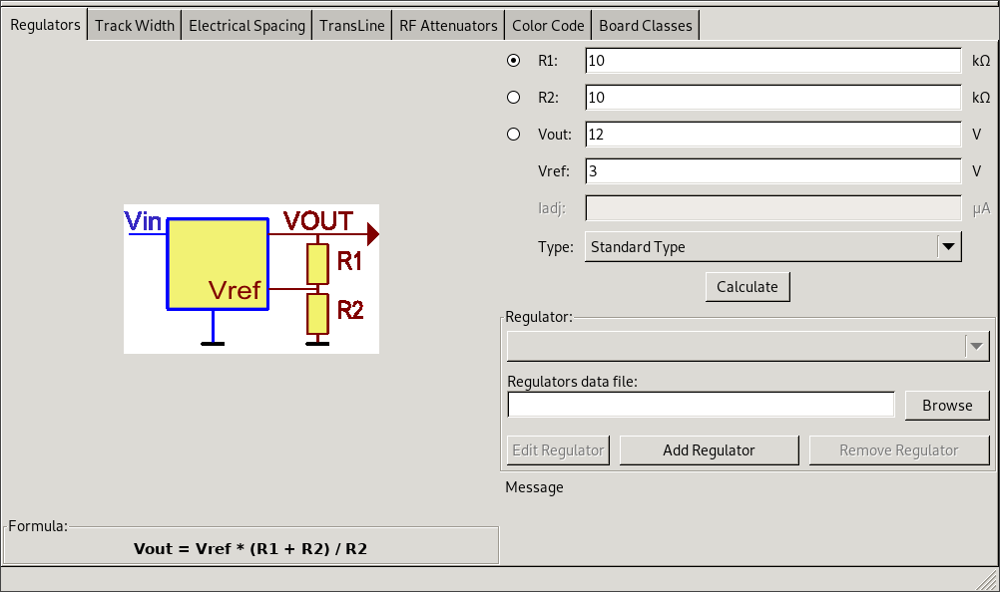
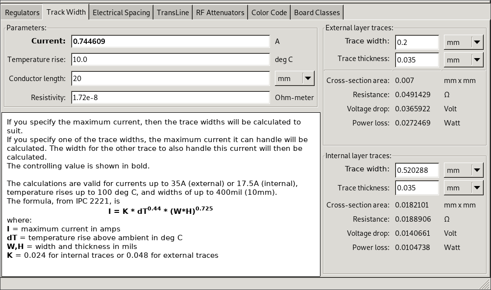
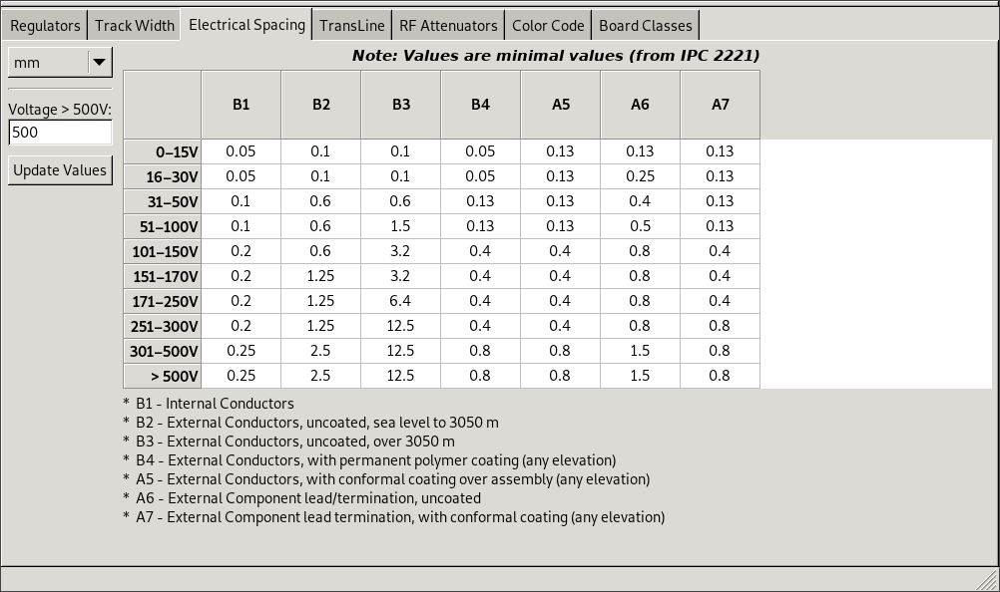
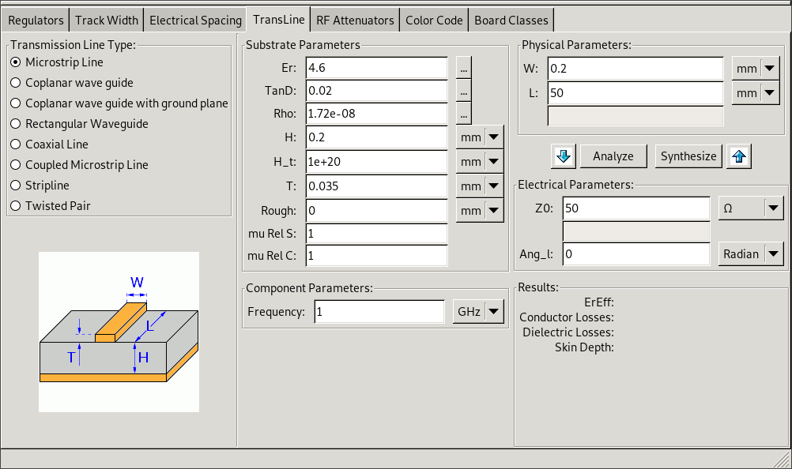
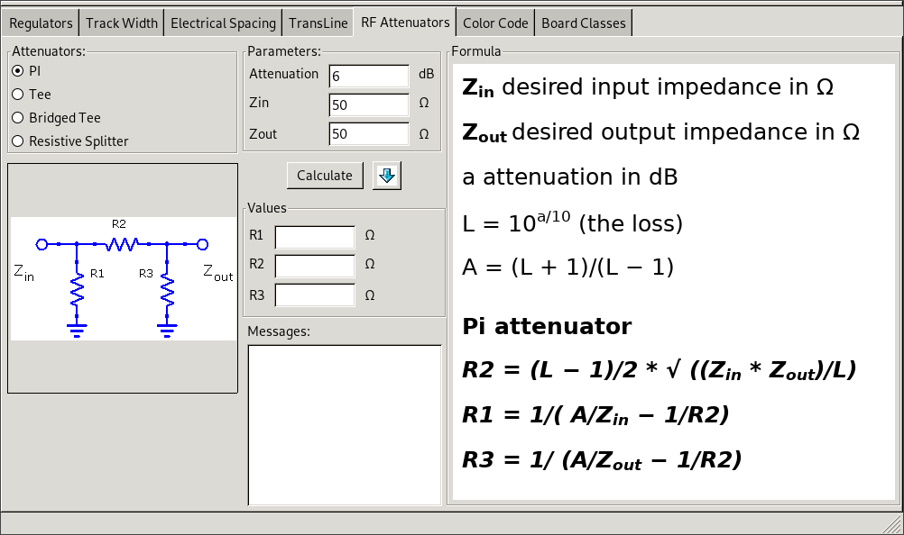
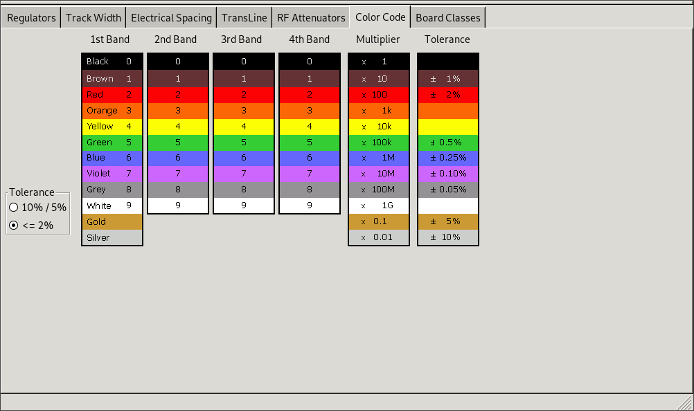
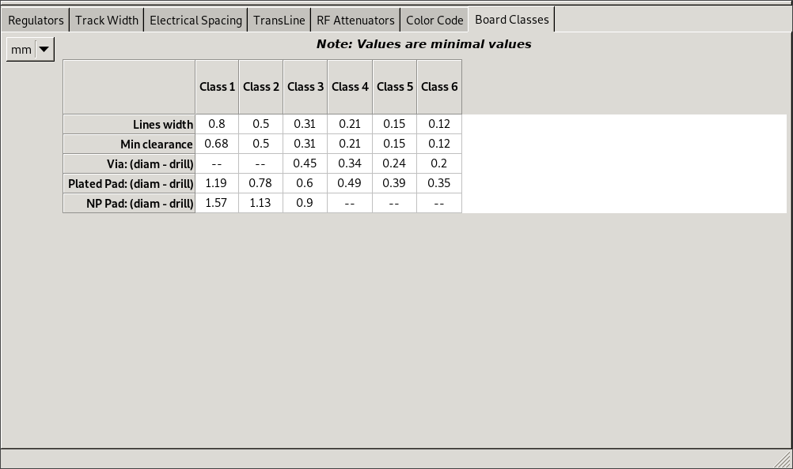

:author: The KiCad Team
:doctype: article
:toc:
:ascii-ids:
:stem: latexmath

= PCB Calculator

_Reference manual_

[[copyright]]
*Copyright*

This document is Copyright (C) 2018 by it's contributors as listed below.
You may distribute it and/or modify it under the terms of either the GNU
General Public License (http://www.gnu.org/licenses/gpl.html),
version 3 or later, or the Creative Commons Attribution License
(http://creativecommons.org/licenses/by/3.0/),
version 3.0 or later.

[[contributors]]
*Contributors*

Heitor de Bittencourt.

[[feedback]]
*Feedback*

Please direct any bug reports, suggestions or new versions to here:

- About KiCad document: https://github.com/KiCad/kicad-doc/issues

- About KiCad software: https://bugs.launchpad.net/kicad

- About KiCad software i18n: https://github.com/KiCad/kicad-i18n/issues

[[publication_date_and_software_version]]
*Publication date and software version*

nov 07, 2018.

[[introduction]]
== Introduction

Introductory blablabla here

structure of PCB Calc.

[[calculators]]
== Calculators

[[regulators]]
=== Regulators

This calculator helps with the task of finding the values of the resistors
needed for linear and low-dropout voltage regulators.

For the _Standard Type_, the output voltage (latexmath:[V_{out}]) as a
function of the reference voltage (latexmath:[V_{ref}]) and resistors
latexmath:[R_1] and latexmath:[R_2] is given by:

latexmath:[
V_{out} = V_{ref} \left ( \frac{R_1 + R_2}{R_1} \right )
]

For the _3 terminal type_, there is a correction factor due to the quiescent
current (latexmath:[I_{adj}]) flowing from the adjust pin:

latexmath:[
V_{out} = V_{ref} \left ( \frac{R_1 + R_2}{R_1} \right ) + I_{adj} R_2
]

This current is typically below latexmath:[100 \mu A] and can be neglected with
caution.

To use this calculator, enter the parameters of the regulator (_Type_,
latexmath:[V_{ref}] and, if needed, latexmath:[I_{adj}]), select the field you
want to calculate (one of the resistors or the output voltage) and enter the
other two values.

[[track-width]]
=== Track Width

[[electrical-spacing]]
=== Electrical Spacing

[[transline]]
=== TransLine

[[rf-attenuators]]
=== RF Attenuators

[[color-code]]
=== Color Code

This calculator helps translating the color bars in a resistor to its value. To use it, first select the _tolerance_ of the resistor: 10%, 5% or smaller than 2%. For example:

* Yellow Violet Red Gold: 4 7 x100 ±5% = 4700 Ω, 5% tolerance
* 1kΩ, 1% tolerance: Brown Black Black Brown Brown

[[board-classes]]
=== Board Classes

